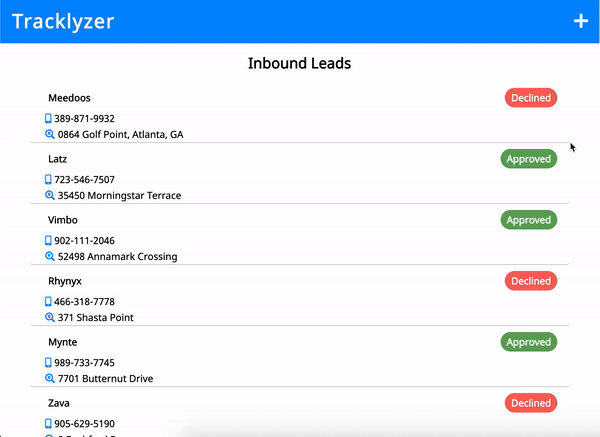

# Tracklyzer

- The purpose of this challenge is to create a front-end application that helps to solve the following business problem:
  - A company is looking to achieve inorganic growth through acquisitions. Develop
    an online tool to track and analyze potential target companies.

#### Necessary Capabilities

- Pull in and view mock data, create list items for each entry.
- Edit a list items.
- Add a list item.
- Remove a list item.

## Getting Started

### Prerequisites

- Node.js
- npm
- Google Maps API Key

```
brew install node

```

### Installing

If on MacOS, I recommend installing homebrew.

#### Install Homebrew

```
/usr/bin/ruby -e "$(curl -fsSL https://raw.githubusercontent.com/Homebrew/install/master/install)"
```

Verify installation

```
brew -v
```

#### Install Node

Install Node.js and the Node Package Manager

```
brew install node
```

Verify installation

```
node -v
npm -v
```

#### Clone the repository

```
git clone git@github.com:salviolorenzo/tracklyzer-react.git
```

#### Install the dependencies

```
npm install
```

#### Create a .env file in the root directory

```
touch .env
```

##### In the .env file:

```
REACT_APP_API_URL= https://maps.googleapis.com/maps/api/js?key={ your API key }&libraries=places
```

#### Start the development environment

```
npm start
```

Open [http://localhost:3000](http://localhost:3000) to view it in the browser.

#### Running tests

```
npm test
```

#### Creating a production build

```
npm run build
```

#### Reset the production build

```
npm run eject
```

**Note: this is a one-way operation. Once you `eject`, you can’t go back!**

## Deployment

This project was deployed via Netlify.com

#### To deploy to Netlify

Create a production build

```
npm build
```

Commit and push your work

```
git add .
git commit -m "add a commit message here"
git push
```

Log in or sign up at _netlify.com_

Connect your github repository

## Built With

- [React.js](https://reactjs.org/) - The web framework used
- [React Router](https://www.npmjs.com/package/react-router) - Application Routing
- [React Swipeable Routes](https://www.npmjs.com/package/react-swipeable-routes) - Routing Animations
- [Recharts](https://www.npmjs.com/package/react-swipeable-routes) - Data Plotting and Chart Displaying
- [Uuid](https://www.npmjs.com/package/uuid) - Generating IDs

## Authors

#### **Lorenzo Salvio**

[GitHub](https://github.com/salviolorenzo) || [Portfolio](https://lorenzosalvio.com)

## Acknowledgements

- @hibiken - React Places AutoComplete

## Product

 
