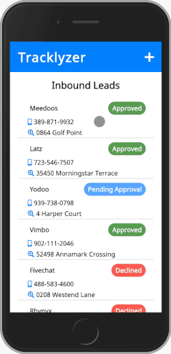

# Tracklyzer

- The purpose of this challenge is to create a front-end application that helps to solve the following business problem:
  - A company is looking to achieve inorganic growth through acquisitions. Develop
    an online tool to track and analyze potential target companies.

#### Necessary Capabilities

- Pull in and view mock data, create list items for each entry.
- Edit a list items.
- Add a list item.
- Remove a list item.

## Getting Started

### Prerequisites

- Node.js
- npm

```
brew install node

```

### Installing

If on MacOS, I recommend installing homebrew.

#### Install Homebrew

```
/usr/bin/ruby -e "$(curl -fsSL https://raw.githubusercontent.com/Homebrew/install/master/install)"
```

Verify installation

```
brew -v
```

#### Install Node

Install Node.js and the Node Package Manager

```
brew install node
```

Verify installation

```
node -v
npm -v
```

#### Clone the repository

```
git clone git@github.com:salviolorenzo/tracklyzer-react.git
```

#### Install the dependencies

```
npm install
```

#### Start the development environment

```
npm start
```

Open [http://localhost:3000](http://localhost:3000) to view it in the browser.

The page will reload if you make edits.<br>
You will also see any lint errors in the console.

#### Running tests

```
npm test
```

Launches the test runner in the interactive watch mode.<br>
See the section about [running tests](https://facebook.github.io/create-react-app/docs/running-tests) for more information.

#### Creating a production build

```
npm run build
```

Builds the app for production to the `build` folder.<br>
It correctly bundles React in production mode and optimizes the build for the best performance.

The build is minified and the filenames include the hashes.<br>
Your app is ready to be deployed!

See the section about [deployment](https://facebook.github.io/create-react-app/docs/deployment) for more information.

#### Reset the production build

```
npm run eject
```

**Note: this is a one-way operation. Once you `eject`, you can’t go back!**

If you aren’t satisfied with the build tool and configuration choices, you can `eject` at any time. This command will remove the single build dependency from your project.

Instead, it will copy all the configuration files and the transitive dependencies (Webpack, Babel, ESLint, etc) right into your project so you have full control over them. All of the commands except `eject` will still work, but they will point to the copied scripts so you can tweak them. At this point you’re on your own.

You don’t have to ever use `eject`. The curated feature set is suitable for small and middle deployments, and you shouldn’t feel obligated to use this feature. However we understand that this tool wouldn’t be useful if you couldn’t customize it when you are ready for it.

## Deployment

This project was deployed via Netlify.com

#### To deploy to Netlify

Create a production build

```
npm build
```

Commit and push your work

```
git add .
git commit -m "add a commit message here"
git push
```

Log in or sign up at _netlify.com_

Connect your github repository

## Built With

- [React.js](https://reactjs.org/) - The web framework used
- [React Router](https://www.npmjs.com/package/react-router) - Application Routing
- [React Swipeable Routes](https://www.npmjs.com/package/react-swipeable-routes) - Routing Animations
- [Recharts](https://www.npmjs.com/package/react-swipeable-routes) - Data Plotting and Chart Displaying
- [Uuid](https://www.npmjs.com/package/uuid) - Generating IDs

## Authors

#### **Lorenzo Salvio**

[GitHub](https://github.com/salviolorenzo) || [Portfolio](https://lorenzosalvio.com)

---

## Product Details



---

## create-react-app Documentation

## Available Scripts

In the project directory, you can run:

## Learn More

You can learn more in the [Create React App documentation](https://facebook.github.io/create-react-app/docs/getting-started).

To learn React, check out the [React documentation](https://reactjs.org/).

### Code Splitting

This section has moved here: https://facebook.github.io/create-react-app/docs/code-splitting

### Analyzing the Bundle Size

This section has moved here: https://facebook.github.io/create-react-app/docs/analyzing-the-bundle-size

### Making a Progressive Web App

This section has moved here: https://facebook.github.io/create-react-app/docs/making-a-progressive-web-app

### Advanced Configuration

This section has moved here: https://facebook.github.io/create-react-app/docs/advanced-configuration

### Deployment

This section has moved here: https://facebook.github.io/create-react-app/docs/deployment

### `npm run build` fails to minify

This section has moved here: https://facebook.github.io/create-react-app/docs/troubleshooting#npm-run-build-fails-to-minify

```

```

```

```
